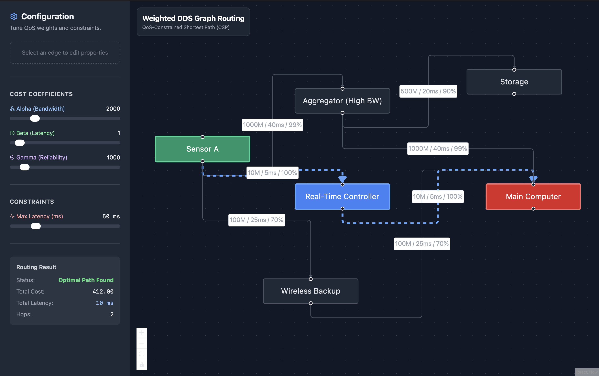
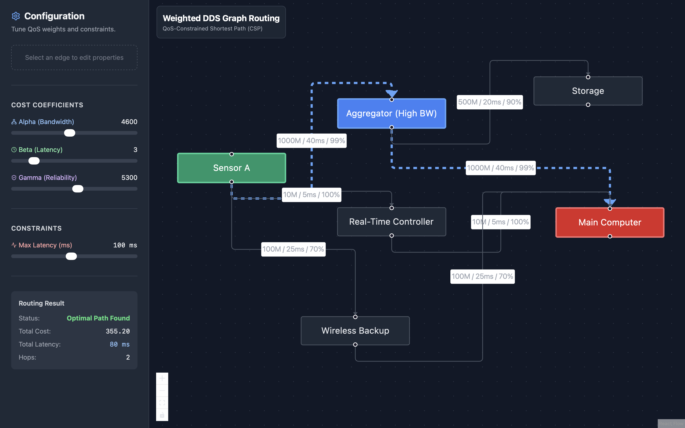
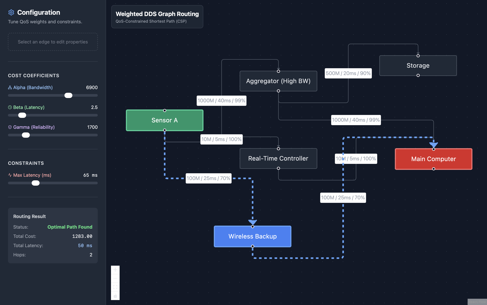

# Weighted Directed Graph Approach to QoS-Based Routing in Data Distribution Services

**Author**: Tuğberk Akbulut  
**Department**: Computer Engineering, Gebze Technical University  
**Contact**: t.akbulut2023@gtu.edu.tr  

---

## Abstract

This project implements a simulation and visualization tool for **Quality of Service (QoS)**-based routing in **Data Distribution Service (DDS)** networks. Traditional routing protocols (like TCP/IP OSPF) generally optimize for hop count or simple bandwidth metrics. However, real-time distributed systems—such as combat management systems or autonomous vehicle fleets—require strict adherence to multidimensional constraints including **Latency**, **Reliability**, and **Bandwidth**.

This application models the DDS network as a **Weighted Directed Graph** and solves the **Constrained Shortest Path (CSP)** problem using a modified Dijkstra algorithm. It allows network architects to visualize how tuning QoS coefficients ($\alpha, \beta, \gamma$) impacts route selection under hard latency constraints.

---

## Mathematical Modeling

We define the network as a graph $G = (V, E)$, where:
-   $V$: The set of Domain Participants (Nodes).
-   $E$: The set of unidirectional communication links (Edges).

### Quality of Service (QoS) Parameters
For every edge $e_{u,v} \in E$, the following metrics are defined:
1.  **Latency ($L(e)$)**: Transmission delay in milliseconds ($ms$).
2.  **Bandwidth ($Bw(e)$)**: Available throughput in Mbps.
3.  **Reliability ($R(e)$)**: Probability of successful packet delivery, $R(e) \in [0, 1]$.

### The Composite Cost Function
To reduce the multi-objective optimization problem to a single-objective shortest path problem, we define a scalar **Cost Function**. The goal is to finding a path satisfying the trade-off between maximizing bandwidth/reliability and minimizing latency.

$$
Cost(e) = \frac{\alpha}{Bw(e)} + \beta \cdot L(e) + \gamma \cdot (1 - R(e))
$$

Where:
-   $\alpha$: Weight coefficient for Bandwidth (higher $\alpha$ prefers high-bandwidth links).
-   $\beta$: Weight coefficient for Latency (higher $\beta$ penalizes slow links).
-   $\gamma$: Weight coefficient for Reliability (higher $\gamma$ penalizes unreliable links).

---

## Algorithm: Constrained Shortest Path (CSP)

Data Distribution Services often impose a hard constraint known as `LATENCY_BUDGET`. Finding the optimal path under a constraint is generally NP-Hard. However, given the relatively small size of DDS domains ($|V| < 100$), we implement a **Modified Dijkstra’s Algorithm** with constraint-based pruning.

### Problem Definition
Find a path $P = \{v_{source}, ..., v_{target}\}$ that minimizes the total cost subject to a maximum latency constraint $\mathcal{L}_{max}$.

$$
\text{minimize } \sum_{e \in P} Cost(e) \quad \text{subject to } \sum_{e \in P} L(e) \le \mathcal{L}_{max}
$$

### Implementation Details
The algorithm maintains the standard priority queue approach of Dijkstra but introduces a pruning step:

1.  Initialize $minCost[v] \leftarrow \infty$ and $pathLatency[v] \leftarrow 0$ for all $v$.
2.  Push source node to Priority Queue (PQ).
3.  While PQ is not empty:
    -   Extract node $u$ with the lowest accumulated $Cost$.
    -   For each neighbor $v$ of $u$:
        -   Calculate potential new latency: $Lat_{new} = pathLatency[u] + L(e_{u,v})$
        -   **Constraint Check**: IF $Lat_{new} > \mathcal{L}_{max}$, prune this path (do not relax).
        -   **Relaxation**: IF $Lat_{new} \le \mathcal{L}_{max}$ AND $Cost_{new} < minCost[v]$:
            - Update $minCost[v]$ and $pathLatency[v]$.
            - Push $v$ to PQ.

This ensures that the returned path is the "cheapest" path (in terms of QoS cost) that strictly satisfies the application's real-time latency requirements.

---

## Installation and Usage

### Prerequisites
-   Node.js (v18+)
-   npm

### Setup
```bash
# Clone the repository
git clone <repository_url>

# Install dependencies
npm install
```

### Running the Simulation
```bash
npm run dev
```
Open your browser at `http://localhost:5173`.

### User Interface Guide
1.  **Siderbar Controls**:
    -   **Cost Coefficients**: Adjust sliders for Alpha, Beta, and Gamma to change the importance of Bandwidth, Latency, and Reliability respectively.
    -   **Max Latency**: Set the hard constraint. Paths violating this total latency will be rejected.
2.  **Toplogy Interaction**:
    -   **View Path**: The optimal path is highlighted in Blue.
    -   **Edit Links**: Click on any edge to open the **Link Editor**. You can manually modify the physical properties (Bandwidth, Latency, Reliability) of a link to simulate network changes or failures.

---

## Technical Stack
-   **Frontend**: React, TypeScript, Vite
-   **Visualization**: React Flow (XYFlow)
-   **Styling**: Tailwind CSS

---

## Screenshots

| Path 1 | Path 2 | Path 3 |
|:---:|:---:|:---:|
|  |  |  |

